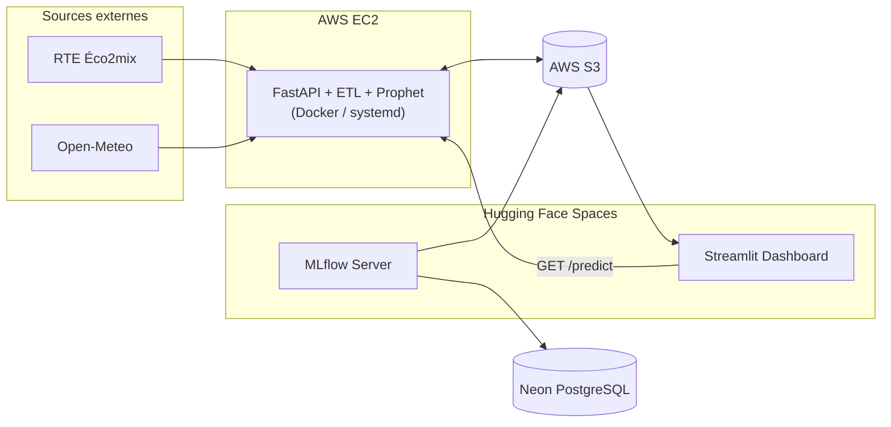

# Prédiction de la consommation électrique en France

> Projet de fin de formation du bootcamp **Jedha - Data Science & Engineering Full Stack**, présenté en Demo Day le 27 mars 2026.

Pipeline MLOps de bout en bout pour la prévision horaire de la consommation électrique nationale française, à partir de l'historique de consommation RTE et de données météorologiques Open-Meteo.

---

## Contexte

L'équilibre instantané entre production et consommation est une contrainte vitale du réseau électrique : un écart trop important peut provoquer un black-out à l'échelle d'une région ou d'un pays. Le cas de l'Espagne en avril 2025 (panne de 18 heures touchant environ 50 millions de personnes, avec microcoupures jusqu'en France, Italie et Allemagne) illustre la sévérité du risque. En France, c'est **RTE** qui assure cette coordination et doit anticiper la consommation pour piloter la production.

La difficulté est que la consommation dépend d'une combinaison de facteurs qui évoluent dans le temps : conditions météorologiques, mais aussi facteurs économiques, géopolitiques et sociétaux (crise énergétique de 2022 et plans de sobriété, transition thermique avec l'essor des pompes à chaleur, déploiement du solaire décentralisé qui réduit la consommation nette, tensions géopolitiques sur l'approvisionnement gaz).

## Objectifs

Construire une solution complète, de l'acquisition des données jusqu'à la mise à disposition des prévisions via une interface web, capable de prédire la consommation électrique nationale française à pas horaire, déployée selon une logique MLOps réaliste : API, conteneurisation, stockage cloud, dashboard et serveur de tracking.

## Architecture



## Stack technique

- **Langage** : Python 3.10
- **Modélisation** : Prophet, scikit-learn
- **API** : FastAPI
- **Dashboard** : Streamlit, Plotly
- **Tracking** : MLflow (backend PostgreSQL Neon, artifact store S3)
- **Infrastructure** : AWS EC2, AWS S3, Docker, systemd, Hugging Face Spaces
- **Sources de données** : RTE Éco2mix (consommation), Open-Meteo (météo des 94 préfectures métropolitaines, coordonnées issues de SPARQL Wikidata avec fallback INSEE)

## Structure du dépôt

```
.
├── api/                # Service FastAPI (Dockerfile, unité systemd)
├── etl/                # Pipeline Extract / Transform / Load
├── ml/prophet/         # Modèle Prophet + notebooks d'entraînement
│   └── train/          # Notebooks 01 → 05 : base → régresseur T → fine-tuning → simulation
├── eda-data/           # Analyse exploratoire (RTE, Open-Meteo, démographie)
├── spaces/
│   ├── mlflow/         # HF Space : serveur MLflow
│   └── streamlit/      # HF Space : dashboard
├── environment.yml     # Environnement Conda
├── requirements.txt    # Dépendances pip
└── pyproject.toml      # Installation éditable du package
```

## Données et ETL

Le module `etl/etl.py` orchestre trois étapes :

1. **Extract** (`extract.py`) : récupère la consommation nationale via l'API RTE Éco2mix et la météo horaire des 94 préfectures métropolitaines via Open-Meteo `/v1/forecast` (appel multi-location).
2. **Transform** (`transform.py`) : agrège les températures départementales en statistiques nationales horaires (`mean`, `min`, `max`, `median`, `std`, `q1`, `q3`) et joint à la consommation.
3. **Load** (`load.py`) : écrit le CSV résultant sur S3 (`dataset/training_dataset.csv`).

L'analyse exploratoire (`eda-data/`) a mis en évidence les saisonnalités quotidienne, hebdomadaire et annuelle de la consommation, ainsi qu'une forte corrélation négative avec la température : motivations directes de la configuration du modèle ci-dessous.

## Modèle Prophet

Le modèle de production est un **Prophet** (Meta) avec régresseurs, défini dans `ml/prophet/model_prophet.py` :

- 6 régresseurs météo : `T_mean`, `T_min`, `T_max`, `T_std`, `T_q1`, `T_q3`
- Saisonnalité journalière activée, saisonnalité hebdomadaire standard désactivée
- Deux saisonnalités hebdomadaires conditionnelles : `weekly_weekday` et `weekly_weekend`, pour capturer le contraste semaine/week-end
- Hyperparamètres : `changepoint_prior_scale = 0.35`, `seasonality_prior_scale = 0.5`
- Fenêtre d'entraînement glissante de **30 jours**, ré-entraînement à chaque appel

À chaque appel de l'API, le modèle est ré-entraîné sur les 30 derniers jours disponibles et produit une prédiction sur les **24 heures suivantes au pas horaire**.

La progression du modèle est documentée dans les notebooks numérotés `01-base-model` → `05-simulation-predictions-finetuned-model` (modèle nu, second modèle de base, ajout du régresseur de température, fine-tuning des hyperparamètres, simulation).

## Évaluation

L'évaluation (notebook `05-simulation-predictions-finetuned-model.ipynb`) repose sur une simulation rétrospective :

- **130 jours** d'historique mobilisés
- **100 modèles** Prophet entraînés indépendamment, chacun sur une fenêtre de **30 jours**
- **Glissement d'1 jour** entre deux modèles consécutifs
- Chaque modèle prédit les **24 heures** suivant sa fenêtre d'entraînement (1 jour de test au pas horaire)
- Métrique reportée : moyenne arithmétique des 100 MAPE de test

La **MAPE** (*Mean Absolute Percentage Error*) est l'erreur absolue moyenne exprimée en pourcentage de la valeur réelle :

$$\text{MAPE} = \frac{1}{n} \sum_{i=1}^{n} \left| \frac{y_i - \hat{y}_i}{y_i} \right| \times 100\%$$

## Résultats

| Modèle | Approche | MAPE moyenne |
|---|---|---|
| **Prophet fine-tuné** | Série temporelle, fenêtre glissante 30 j, régresseurs météo | **2,71 %** |
| Régression linéaire (baseline) | Sans série temporelle, large volume d'entraînement, ré-introduction des prédictions | 9,44 % |

L'approche série temporelle avec régresseurs météo divise l'erreur moyenne par ~3,5 par rapport à la baseline linéaire, et passe sous la barre des 4 % d'erreur fixée comme objectif.

## Déploiement

| Composant | Hébergement | Détails |
|---|---|---|
| API de prédiction | AWS EC2 | Conteneur Docker (`python:3.10-slim`), supervisé par `systemd` (`api/fastapi-app.service`, `Restart=always`, port 8000, env-file `/home/ubuntu/.env`). Route unique `GET /predict` qui enchaîne ETL puis prédiction et écrit `dataset/predictions.csv` sur S3. |
| Dashboard Streamlit | Hugging Face Space (Docker, port 7860) | Deux pages (`Prédiction`, `Historique`), bouton de déclenchement de prédiction qui appelle l'API EC2 via `PREDICTION_API_URL`. |
| Serveur MLflow | Hugging Face Space (Docker) | Basic auth, backend store PostgreSQL hébergé sur Neon, artifact store S3. Comptes utilisateurs provisionnés au démarrage via `start.sh`. |
| Stockage | AWS S3 (région `eu-west-3`) | Bucket unique pour datasets, prédictions et artifacts MLflow. |

## Installation et reproduction de l'environnement

### Créer l'environnement Conda

```bash
conda env create -f environment.yml
```

### Activer l'environnement

```bash
conda activate dday
```

### Mettre à jour l'environnement

Après modification de `environment.yml` ou `requirements.txt` :

```bash
conda env update -f environment.yml --prune
```

### Variables d'environnement

Un fichier `.env` à la racine du projet est attendu, contenant a minima :

```dotenv
AWS_ACCESS_KEY_ID=...
AWS_SECRET_ACCESS_KEY=...
AWS_BUCKET=...
TRAINING_DATA=dataset/training_dataset.csv
PREDICTION_DELAY=0
```

### Lancer l'API en local

```bash
python api/main.py
```

L'API expose `GET http://localhost:8000/predict`.

### Construire l'image Docker de l'API

Le contexte de build doit être la racine du projet pour inclure les modules `etl/` et `ml/` :

```bash
docker build -f api/Dockerfile -t fastapi-app:latest .
```

## Perspectives

- **Raccordement effectif à MLflow** : l'infrastructure de tracking est en place (Space MLflow, Neon, S3), mais le code d'entraînement ne loggue pas encore expériences, paramètres et artefacts. Étape d'intégration prioritaire.
- **Comparaison à d'autres modèles** pour évaluer si des gains marginaux justifient un changement de famille algorithmique.
- **Extension de l'horizon de prédiction à 48 h**.
- **Ré-entraînement programmé** automatique pour préserver la performance face aux dérives structurelles de la consommation.

## Auteurs

- Nicolas Billard
- Clément Redondo
- Yoann Robert